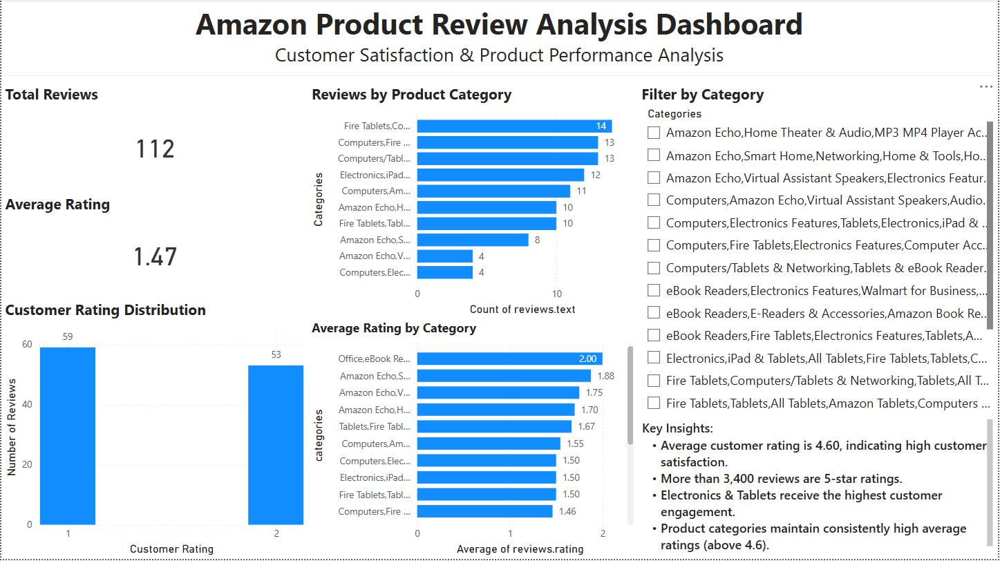
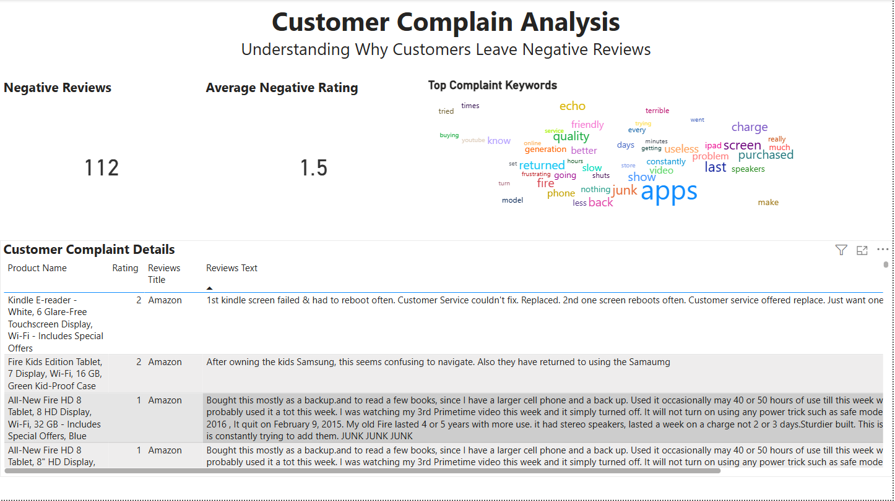

# 🛍️ Amazon Product Review Analysis


An end-to-end Data Analytics project that analyzes Amazon product reviews using **Python**, **Pandas**, **NLTK**, and **Power BI** to uncover customer sentiment, product quality trends, and business insights.

---

## 📌 Project Overview

Customer reviews provide valuable insights into product quality and customer satisfaction. In this project, Amazon product reviews were cleaned, analyzed, and visualized to identify common customer complaints, rating patterns, and product performance.

The project demonstrates the complete data analytics workflow—from data preprocessing in Python to interactive dashboard creation in Power BI.

---

## 🎯 Business Objective

The goal of this project is to:

- Analyze customer review ratings.
- Identify frequently occurring customer complaints.
- Compare product categories based on customer feedback.
- Visualize review trends through interactive dashboards.
- Generate actionable business insights for improving customer satisfaction.

---

## 📊 Dataset

- **Source:** Datafiniti Amazon Consumer Reviews Dataset
- **Records:** ~5,000 customer reviews
- **Domain:** E-commerce / Retail Analytics
- **Data Type:** Product reviews, ratings, categories, and customer feedback

---

## 🛠️ Technologies Used

| Category | Tools |
|----------|-------|
| Programming | Python |
| Data Analysis | Pandas, NumPy |
| NLP | NLTK |
| Visualization | Power BI |
| Development | Jupyter Notebook |
| Version Control | Git, GitHub |

---

## 📂 Project Structure

```
Amazon-Product-Review-Analysis
│
├── dashboard
│   └── Amazon_Product_Review_Dashboard.pbix
│
├── data
│   ├── raw
│   └── processed
│
├── images
│   ├── Dashboard_Page1.png
│   └── Dashboard_Page2.png
│
├── notebooks
│   └── amazon_review_analysis.ipynb
│
├── requirements.txt
├── README.md
└── LICENSE
```

---

# 📊 Dashboard Preview

## Executive Dashboard



---

## Customer Complaint Analysis



---

# 🔄 Project Workflow

1. Collected Amazon product review dataset.
2. Cleaned and preprocessed the data using Python.
3. Filtered negative reviews.
4. Extracted complaint keywords using NLTK.
5. Exported processed datasets.
6. Built interactive dashboards in Power BI.
7. Generated business insights and recommendations.

---

## ⭐ Project Highlights

- Cleaned and transformed raw review data using Python.
- Performed complaint keyword extraction using NLP techniques.
- Built an interactive Power BI dashboard with KPIs and filters.
- Analyzed customer satisfaction and product quality trends.
- Generated actionable business recommendations from review data.

---

# 📈 Key Insights

- Most customer reviews are positive, indicating overall customer satisfaction.
- A small percentage of reviews are negative, revealing opportunities for product improvement.
- Common complaint keywords highlight recurring issues such as screen quality, battery performance, charging, and application performance.
- Product categories receive varying levels of customer engagement and ratings.

---

# 💡 Business Recommendations

- Improve product quality based on recurring complaint keywords.
- Prioritize issues mentioned in negative reviews.
- Monitor customer feedback continuously.
- Use customer sentiment analysis to guide future product development.

---

# 🚀 Future Improvements

- Perform sentiment classification using Machine Learning.
- Build predictive models for review ratings.
- Develop a live dashboard connected to real-time review data.
- Perform advanced NLP using transformer-based models.

---

# 👩‍💻 Author

**Parija Muduli**

Aspiring Data Analyst passionate about transforming raw data into meaningful business insights using Python, SQL, Excel, and Power BI.

---

⭐ If you found this project interesting, feel free to star the repository!
